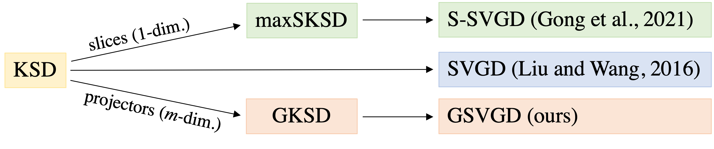
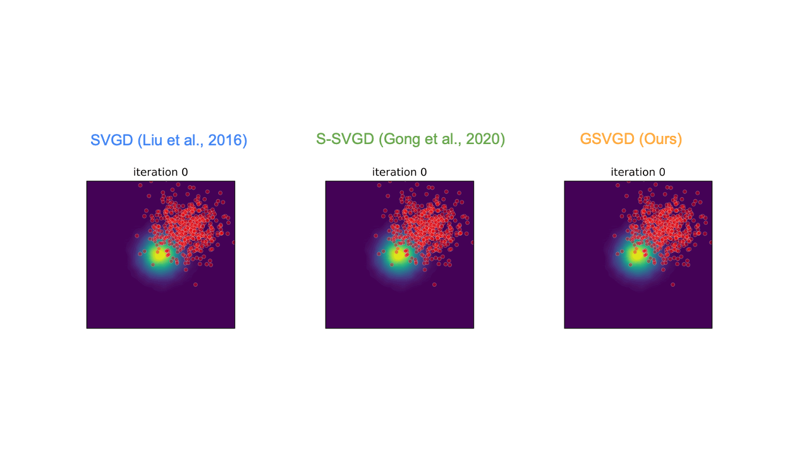

# GSVGD

[[Paper](https://proceedings.mlr.press/v151/liu22a.html)][[Slides](https://docs.google.com/presentation/d/e/2PACX-1vTMmAQEaSB--eTTrg0xzZBdgdA3w530kw4ENg5Oh_a7YpCK4Gd28vc8tMPDMjarevyKjnNF4c1vEccG/pub?start=false&loop=false&delayms=3000)][[Poster](https://xinglliu.github.io/files/gsvgd_poster.pdf)]

[](https://github.com/harrisonzhu508/M-SVGD/actions/workflows/tests.yml)

[](./thumbnail/summary.png)

[](./imgs/gsvgd_cover.gif)

## Data
`Covertype` data downloaded from https://archive.ics.uci.edu/ml/datasets/covertype

## Other Dependencies
- Code for Sliced-SVGD is adapted from [Wenbo Gong's repo](https://github.com/WenboGong/Sliced_Kernelized_Stein_Discrepancy)
- Code for optimization on Grassmann manifold is adapted from [Pymanopt](https://www.pymanopt.org/)

## Run experiments
The code below runs the numerical experiments in the paper. 

1. The `.sh` scripts assume 8 GPUs are available. You can also use CPUs by changing the `--gpu` argument in these scripts to `--gpu=-1`.
2. Note: These experiments can take hours to finish.
```
# install GSVGD module
pip install .

# e.g.1 run multivariate gaussian experiment and generate plots
sh scripts/run_gaussian.sh

# e.g.2 run conditioned diffusion and generate plots
sh scripts/run_diffusion.sh
```

## Basic usage
```python
'''
  distribution: target distribution class with `log_prob` method (up to a constant term)
  kernel: instance of kernel class
  manifold: instance of Grassmann manifold class for projector update
  optimizer: instance of optimizer class for particle update
  
  delta: stepsize for projector update
  T: initial temperature T0
  X: initial particles
  A: initial projectors
  m: number of projectors
  epochs: number of iterations
'''
# instantiate GSVGD class
gsvgd = FullGSVGDBatch(
    target=distribution,
    kernel=kernel,
    manifold=manifold,
    optimizer=optimizer,
    delta=delta,
    T=T
)

# update particles
_ = gsvgd.fit(X=X, A=A, m=m, epochs=epochs, threshold=0.0001*m)

# final particles: X (updates are done in-place)
```

## Run tests

```python
python -m pytest
```

## Code directory

    .
    |
    └── README.md
    ├───├requirements.txt: Dependencies.
    ├───├setup.py: Setup script.
    ├───├data: covertype data.
    ├───├experiments: main scripts for the 5 numerical experiments.
    ├───├plots: folder to hold plots.
    ├───├scripts: Shell scripts to run the experiments and generate plots.
    ├───├src: Source files for implementing each sampling method, and util functions for experiments.
        ├───├Sliced_KSD_Clean: Utils for Sliced SVGD adapted from Wenbo Gong.
        ├───├blr.py: Utils for Bayesian logistic regression.
        ├───├diffusion.py: Utils for conditioned duffition.
        ├───├gsvgd.py: GSVGD class (main).
        ├───├kernel.py: Kernel class.
        ├───├manifold.py: Class for optimisation on the Grassmann manifold, adapted from Pymanopt
        ├───├metrics.py: Metric class for evaluation of results.
        ├───├s_svgd.py: S-SVGD class, adapted from Wenbo Gong.
        ├───├svgd.py: SVGD class.
        ├───├utils.py: Other utils.
    ├───├tests: unittests
    ├───├thumbnail: Thumbnail fig.
